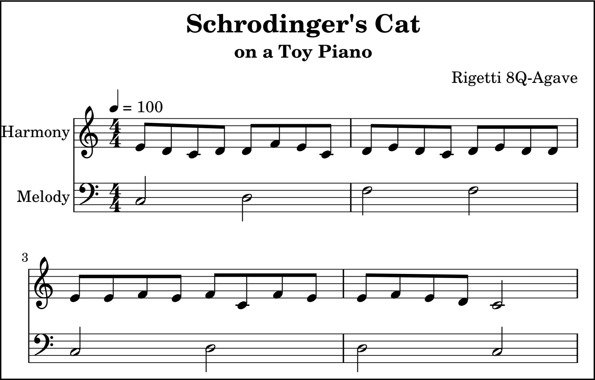

# Quantum Toy Piano

The Quantum Toy Piano application enables a user to compose music that is performed by a quantum computer. The musical composition consists of a series of quantum circuits. Each note in the performance of a composition is a quantum state, which when measured results in a pitch determined by nature. This normally results in unique melodies and harmonies each time a given composition is performed by the quantum computer. Fig. 1 contains the music score captured from one such performance.

## Installation

To install.

