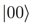

# Jamming with a Quantum Computer

[Musical improvisation](https://en.wikipedia.org/wiki/Musical_improvisation) is the creative activity of composing music "in the moment" while performing it, often in a [jam session](https://en.wikipedia.org/wiki/Jam_session) with other musicians. Although composing and performing music is a creative process, the underlying musical style informs the probabilities of note and rhytym choices that the musician makes. For example, when improvising in the style of [twelve-bar blues](https://en.wikipedia.org/wiki/Twelve-bar_blues), the notes played with the highest frequency of occurrence are typically the five that comprise the corresponding [minor pentatonic scale](https://en.wikipedia.org/wiki/Pentatonic_scale#Minor_pentatonic_scale). [Leonard B. Meyer](https://en.wikipedia.org/wiki/Leonard_B._Meyer) expressed this idea in the book entitled "Music, the Arts, and Ideas" [[1]](#references)

> Once a musical style has become part of the habit responses of composers, performers, and practiced listeners it may be regarded as a complex system of probabilities. That musical styles are internalized probability systems is demonstrated by the rules of musical grammar and syntax found in textbooks on harmony, counterpoint, and theory in general. The rules stated in such books are almost invariably stated in terms of probability. 

This idea of musical style being a complex system of probabilities fits perfectly with the probabilistic nature of quantum mechanics, which is a phenomena leveraged by quantum computing. To implement this idea, I decided to create an application, named Quantum Music Composer, that makes use of a quantum computer to improvise music in a very simplified version of [17th century counterpoint](https://en.wikipedia.org/wiki/Counterpoint). Fig 1 shows an example improvisational performance. The application is licensed under Apache License Version 2.0, and is available in [this repository](https://github.com/JavaFXpert/quantum-toy-piano) along with instructions in using it. 

*FIG. 1. Improvisational performance of a quantum computer captured in a music score* 

As stated in the instructions, to create a quantum musical composition, the user first supplies the desired probabilities for a given pitch to follow another given pitch melodically, does the same for harmonic probabilities, and clicks some buttons. The quantum computer then improvises a musical performance. This begs the question: "How can a quantum circuit be constructed in such a way that its measurements result in desired transition probabilities from a given note to other notes?" We'll address that question by describing the following three steps that the Quantum Music Composer application logic takes to accomplish this task:

1. Express the desired transition probabilities
2. Approximate the desired probabilities in a unistochastic matrix
3. Create a quantum circuit that realizes the underlying unitary matrix

## Expressing the desired transition probabilities

A common structure for expressing transition probabilities from one state to another state is known as a [stochastic matrix](https://en.wikipedia.org/wiki/Stochastic_matrix). Normally, each row (or column) of a stochastic matrix sums to 1, because the sum of the transition probabilities should be 1. For reasons that I'll discuss soon, this application uses a special type of stochastic matrix called a [doubly-stochastic matrix](https://en.wikipedia.org/wiki/Doubly_stochastic_matrix) which requires each of the rows, as well as each of the columns, to sum to 1. Fig. 2 contains a screenshot of a user interface component that represents a doubly-stochastic matrix in which the user may enter desired probabilities for transitioning from each of the musical pitches in the row header (**C**, **D**, **E** and **F**) to each of the musical pitches in the column header (also **C**, **D**, **E** and **F**).

*FIG. 2. Doubly-stochastic matrix for entering desired melodic transition probabilities*

Now that the desired transition probabilities for our melody have been expressed, we need to put them in a form that can be used by a quantum computer. Because [quantum gates](https://en.wikipedia.org/wiki/Quantum_logic_gate) are represented by [unitary matrices](https://en.wikipedia.org/wiki/Unitary_matrix), we'll create a unitary matrix whose entries, when squared, result in a [unistochastic matrix](https://en.wikipedia.org/wiki/Unistochastic_matrix) containing an approximation of the desired probabilities. 

## Approximating the desired probabilities in a unistochastic matrix

A unistochastic matrix is a doubly-stochastic matrix with the additional quality that the entries are the squares of the absolute values of the entries in some unitary matrix. Every unistochastic matrix is a doubly-stochastic matrix, but the converse is not true, so we need to do some special processing to populate the unistochastic matrix. To create an underlying unitary matrix, the application logic uses the following approach when the user clicks the **Optimize Rotations** button in Fig. 3:

*FIG. 3. Orthogonal matrix before clicking the **Optimize Rotation** button*

- **Start with a 4x4 [identity matrix](https://en.wikipedia.org/wiki/Identity_matrix).** This defines an [orthogonal matrix](https://en.wikipedia.org/wiki/Orthogonal_matrix) (unitary matrix without complex numbers) in which each row (and column) are orthogonal [unit vectors](https://en.wikipedia.org/wiki/Unit_vector). 
- **Gradually rotate in six degrees-of-freedom.** The four-dimensional vector space defined by the orthogonal matrix has six degrees of freedom in which it may be rotated. The application logic gradually rotates these until the difference between each entry in the doubly-stochastic matrix and the square of each entry in the orthogonal matrix is minimized. Fig. 4 shows the resulting orthogonal matrix on the left side, and the corresponding unistochastic matrix on the right side when the user selects the **Show Probabilities** checkbox. Fig. 5 shows these rotation possibilities in six sliders with which you can see the effects of applying various rotations on the orthogonal matrix. Each of these sliders has the range  radians.

*FIG. 4. Optimized orthogonal matrix (left), and corresponding unistochastic matrix (right)*

*FIG. 5. Sliders for experimenting with effects of degree of freedom rotations*

Now it may be clear why the user enters desired probabilities into a doubly-stochastic matrix: The rows and columns of the resulting unistochastic matrix sum to 1, so the optimization can be most accurate if the desired probabilities do as well.

So far we've tackled two of the three steps outlined previously: 1) Express the desired transition probabilities, and 2) approximate the desired probabilities in a unistochastic matrix. In the remaining step we'll create a quantum circuit that may be run on a quantum computer so it can improvise a melody. 

## Creating a quantum circuit that realizes the underlying unitary matrix

As mentioned earlier, quantum gates are represented by unitary matrices. Given a unitary matrix, a circuit that realizes it may be designed. The question now becomes: How can we design a quantum circuit that realizes the orthogonal matrix (which is a unitary matrix) in the left side of Fig. 4? One way to do this is to leverage the same degree-of-freedom rotation angles that produced the orthogonal matrix. Fig. 6 is an abstract version of the circuit used in the application, where each of the **𝜃** values are supplied by the corresponding degree-of-freedom rotation angle.

*FIG. 6. Quantum circuit that realizes the unitary matrix*

The inputs to this quantum circuit are quantum states that represent each of the four note pitches, as shown in Fig. 7. Keep in mind that the top wire of the circuit is the least significant qubit, so for example if the input note pitch is **D**, the bottom wire input is  and the top wire input is .

| Note Pitch | Quantum State                           |
| ---------- | --------------------------------------- |
| **C**      |  |
| **D**      |  |
| **E**      |  |
| **F**      |  |

*FIG. 7. Note pitches and corresponding input to quantum circuit*

As a result, the probabilities of each **Quantum State** in Fig. 7 being the measured state should reflect the desired probabilities entered into the doubly-stochastic matrix (shown in Fig. 2) by the user. Each measured state is then used as input to the circuit until the entire melody is improvised. The same steps outlined previously also apply to improvising harmonies in the application, using presumably different desired probabilities.

## Rock on!

Now that you know how the Quantum Music Composer application creates circuits that inform a quantum computer of your melodic and harmonic preferences, please try it out and jam with your favorite quantum computer or simulator!

## References

[1] Leonard B. Meyer, *Music, the Arts, and Ideas* (University of Chicago Press, 1967)